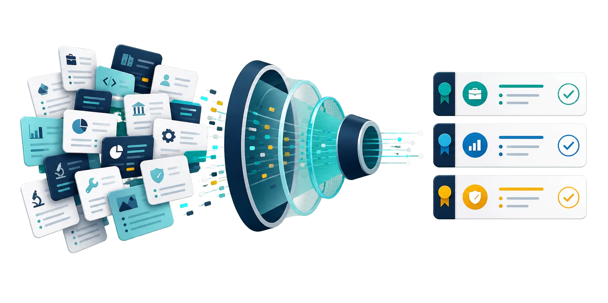
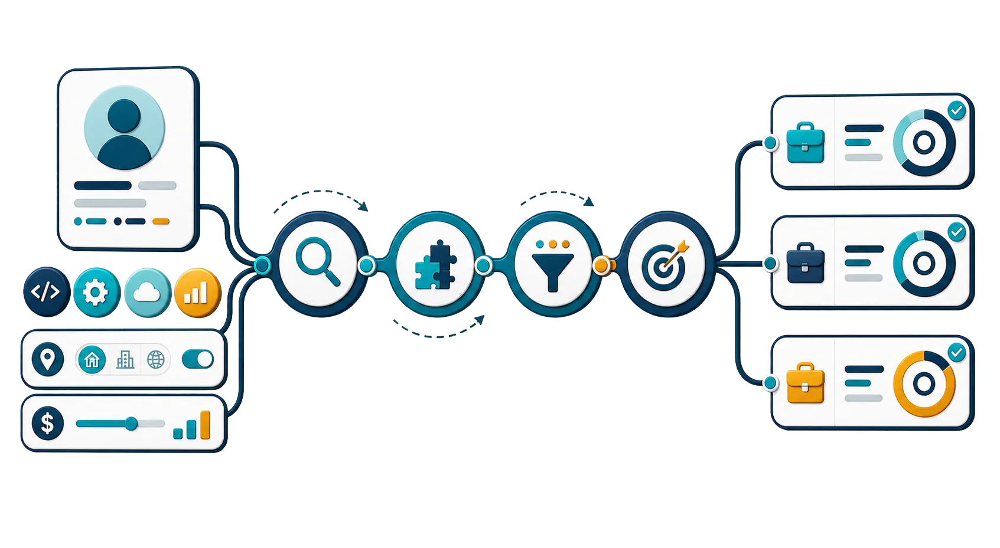
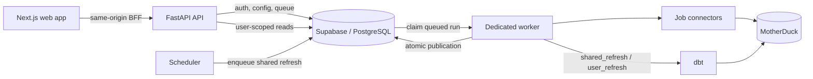
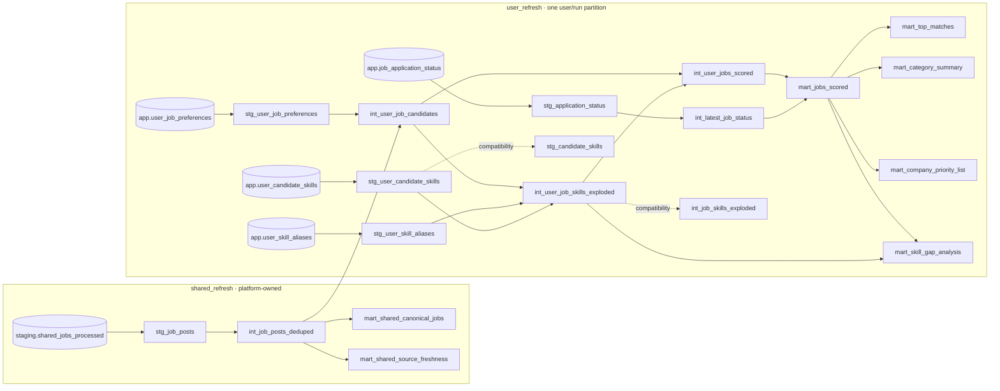

# CareerSignals

<p align="center">
  <strong>Find the roles worth your time.</strong><br />
  Personal job-search intelligence that turns scattered postings into a ranked, explainable action queue.
</p>

<p align="center">
  <a href="https://jobs.swiftaihub.com/careersignals">
    
  </a>
  <a href="https://jobs.swiftaihub.com/careersignals">
    
  </a>
</p>

<p align="center">
  <a href="https://jobs.swiftaihub.com/careersignals">
    
  </a>
</p>

CareerSignals continuously organizes job postings into a shared job universe, then evaluates each role against a user's skills, goals, location, salary expectations, work preferences, and other signals. The result is a focused workspace for discovering strong matches, understanding every score, identifying skill gaps, and tracking applications.

**[Explore the live product →](https://jobs.swiftaihub.com/careersignals)**

## Why CareerSignals?

- **One focused workspace** - bring relevant jobs, match signals, and application progress together.
- **Explainable rankings** - see how skills, seniority, salary, industry, location, work model, and visa signals affect each score.
- **Personal priorities** - update your preferences and let the ranking adapt to what matters now.
- **Actionable insights** - review top matches, recurring skill gaps, company priorities, and search trends.
- **Built-in application tracking** - move roles through Saved, Applied, Interview, Offer, Rejected, and Archived stages.
- **Tenant-safe analytics** - every personal build and publication is scoped to one authenticated user and one immutable run.

<p align="center">
  
</p>

## How it works

1. **Tell CareerSignals what fits.** Add target roles, skills, locations, salary expectations, work arrangements, and other preferences.
2. **CareerSignals refreshes the market.** System-owned connectors collect jobs and normalize them into one deduplicated shared dataset.
3. **Every role is evaluated.** A user-scoped dbt build filters, categorizes, and scores the shared job universe using your personal signals.
4. **You move the best roles forward.** Review the strongest matches first and track each opportunity from discovery to outcome.

<p align="center">
  
</p>

## Product experience

| Area | What it gives you |
| --- | --- |
| Dashboard | Search volume, match tiers, work arrangements, visa signals, and application funnel metrics |
| Job Explorer | Filterable job discovery with match evidence and application status tracking |
| Top Matches | The highest-confidence opportunities, ranked for the current user |
| Skill Gap | Skills that recur across relevant jobs but are missing from the candidate profile |
| Companies | Employers prioritized by matching role count and best available opportunity |
| Settings | Guided preferences, skills, ranking weights, revisions, pipeline history, and export |

The live site is served under `/careersignals`; for example, the dashboard route is `https://jobs.swiftaihub.com/careersignals/dashboard`.

### Try the demo

Open **[CareerSignals](https://jobs.swiftaihub.com/careersignals)** and choose **Explore live demo**.

- Username: `demo`
- Password: not required
- Demo data: 20 curated jobs in a permanent, read-only tenant

Demo users can explore the product without changing settings, running a pipeline, updating application status, or exporting the full dataset.

## Architecture at a glance

CareerSignals is a hosted, multi-user application built with Next.js, FastAPI, Supabase/PostgreSQL, MotherDuck, and dbt.



The central safety boundary is simple: **shared job acquisition and personal matching are separate stages with separate ownership**.

- The platform owns connector execution, shared refresh scheduling, and the `shared_refresh` selector.
- The authenticated user owns only their preferences and personal result partition.
- The API never accepts a browser-supplied tenant UUID or arbitrary dbt selector.
- A failed personal build leaves the previously published result partition unchanged.

## dbt model data pipeline

The graph below mirrors the current `ref()` and `source()` dependencies. Solid paths are primary serving models; dashed paths are compatibility models retained for downstream consumers.



The selectors are intentionally fixed:

```bash
# Candidate-independent shared models
cd dbt
dbt build --selector shared_refresh --profiles-dir .

# One trusted user/run partition
dbt build --selector user_refresh --profiles-dir . \
  --vars '{"user_uuid":"USER_UUID","run_uuid":"RUN_UUID","connector_run_uuid":"CONNECTOR_RUN_UUID"}'
```

Every user model calls `require_user_context()`. Never run a personal refresh with `--full-refresh`, accept a selector from an HTTP request, or delete an unqualified multi-user table.

## Quick start

### Prerequisites

| Tool | Version / purpose |
| --- | --- |
| Python | 3.11 or 3.12 |
| Node.js | 22 or newer, required by the pinned Cloudflare toolchain |
| Supabase CLI | Local Supabase stack or a linked hosted project |
| MotherDuck | Database and token for shared and personal dbt execution |

Supabase is required because the migrations use `auth.users`, `auth.uid()`, and Supabase database roles. A plain PostgreSQL database is not a drop-in replacement.

### 1. Clone and install

```bash
git clone https://github.com/swiftaihub/CareerSignals.git
cd CareerSignals
python -m venv .venv
```

Windows PowerShell:

```powershell
.venv\Scripts\Activate.ps1
python -m pip install -r requirements.txt
```

macOS/Linux:

```bash
source .venv/bin/activate
python -m pip install -r requirements.txt
```

Install the frontend and dbt dependencies:

```bash
cd apps/web
npm install
cd ../../dbt
dbt deps
dbt compile --profiles-dir .
cd ..
```

### 2. Configure the environment

```powershell
Copy-Item .env.example .env
Copy-Item apps/api/.env.example apps/api/.env
Copy-Item apps/web/.env.example apps/web/.env.local
```

Minimum backend configuration:

```dotenv
CAREERSIGNAL_SAAS_MODE=true
CAREERSIGNAL_ENVIRONMENT=development
CAREERSIGNAL_DATA_MODE=postgres
DATABASE_URL=postgresql://...
SUPABASE_URL=https://...
SUPABASE_ANON_KEY=...
SUPABASE_SERVICE_ROLE_KEY=...
SUPABASE_JWT_AUDIENCE=authenticated
DEMO_USER_UUID=00000000-0000-4000-8000-000000000020
DEMO_SESSION_SECRET=<long-random-secret>
MOTHERDUCK_TOKEN=...
MOTHERDUCK_DATABASE=CareerSignal
```

Minimum frontend configuration:

```dotenv
# Server-only
API_BASE_URL=http://localhost:8000
PASSWORD_RECOVERY_COOKIE_SECRET=<at-least-32-random-bytes>

# Safe for browser use
NEXT_PUBLIC_SITE_ORIGIN=http://localhost:3000
NEXT_PUBLIC_BASE_PATH=
NEXT_PUBLIC_SUPABASE_URL=https://your-project.supabase.co
NEXT_PUBLIC_SUPABASE_PUBLISHABLE_KEY=sb_publishable_REPLACE_WITH_BROWSER_KEY
```

Leave `NEXT_PUBLIC_BASE_PATH` empty for normal local development. Set it to `/careersignals` for a production-equivalent local build.

> [!CAUTION]
> Never expose `SUPABASE_SERVICE_ROLE_KEY`, `DATABASE_URL`, `MOTHERDUCK_TOKEN`, `DEMO_SESSION_SECRET`, connector credentials, or any other secret through a `NEXT_PUBLIC_` variable.

Password recovery also requires the matching callback URL in Supabase. See [Supabase password management](docs/supabase-password-management.md).

### 3. Prepare Supabase

For an explicitly disposable local environment:

```bash
supabase start
supabase db reset
```

For hosted development or staging:

```bash
supabase link --project-ref "$SUPABASE_PROJECT_REF"
supabase db push --dry-run
supabase db push
```

Bootstrap the first Admin and seed the read-only Demo tenant after migrations are applied:

```bash
python scripts/bootstrap_admin.py
python -m scripts.seed_demo
```

`ADMIN_BOOTSTRAP_PASSWORD` is read from the environment and never printed. Both commands are designed for repeatable setup. Read [database migrations and rollback](docs/database/migrations.md) before changing a shared database.

### 4. Run locally

Start these four processes from the repository root:

```bash
# Terminal 1 - API
uvicorn apps.api.main:app --reload --host 0.0.0.0 --port 8000

# Terminal 2 - queue worker
python -m apps.worker.main

# Terminal 3 - shared-refresh scheduler
python -m apps.scheduler.main

# Terminal 4 - frontend
cd apps/web && npm run dev
```

Open `http://localhost:3000`. The API health endpoint is `http://localhost:8000/api/health`.

Alternatively, after preparing `.env` and `apps/web/.env.local`:

```bash
docker compose up
```

The Compose stack runs the API, worker, scheduler, and web processes. Configure a real MotherDuck service and a Supabase local stack or hosted project separately.

## Pipeline operations

### Shared refresh

The global pipeline aggregates acquisition preferences from every eligible active production user, normalizes connector requests, refreshes shared dbt models, and publishes shared job data only after the full build succeeds.

```env
CONNECTOR_REFRESH_CRON=0 7,16,21 * * *
CONNECTOR_REFRESH_TIMEZONE=America/New_York
CONNECTOR_REFRESH_TRIGGER_MODE=scheduled
```

The scheduler only enqueues metadata. The worker claims global runs and uses the same lock and publication path for scheduled, Admin, CLI, and first-user bootstrap refreshes.

To enqueue a trusted shared refresh manually:

```bash
python scripts/refresh_connectors.py
# Equivalent explicit form
python scripts/refresh_connectors.py --enqueue
python -m apps.worker.main
```

### Personal refresh

`POST /api/pipeline-runs` snapshots the authenticated user's effective configuration, binds the run to the latest successfully published shared connector run, and queues only `user_refresh`.

For the first user, the server creates a durable bootstrap workflow: it freezes the user's acquisition configuration, queues a `first_user_bootstrap` shared refresh, waits for publication, binds the waiting personal run to that exact connector run, and then starts personal matching. Duplicate first clicks return the existing workflow.

## Configuration model

| File | Ownership | Purpose |
| --- | --- | --- |
| `config/candidate_profile.yml` | Repository default + user override | Candidate profile defaults |
| `config/jobs_config.yml` | Repository default + user override | Search and ranking preferences |
| `config/skill_taxonomy.yml` | Repository default + user override | Skill aliases and matching vocabulary |
| `config/platform_connector_config.yml` | System only | Sources, budgets, retries, freshness, and schedules |

```text
repository default + validated user override = effective user configuration
```

Every successful save creates an immutable revision. Restoring an older version creates a new revision instead of rewriting history. Saving preferences never calls external job APIs in the request/response path; updated acquisition fields are used by the next global refresh.

## Repository map

```text
apps/api/                         FastAPI application and authorization boundary
apps/web/                         Next.js App Router frontend and authenticated BFF
apps/worker/                      PostgreSQL queue worker for dbt runs
apps/scheduler/                   Optional cron trigger for shared refreshes
config/                           User defaults and platform connector configuration
data/demo/demo_jobs.json          Fixed 20-job Demo fixture
dbt/                              Shared and user models, tests, macros, and selectors
docs/                             Deployment, operations, and migration guidance
deployment/                       Deployment overlays
packages/careersignal_core/       Repositories, tasks, storage, and publication
scripts/                          Bootstrap, seed, migration, and refresh entrypoints
supabase/migrations/              Ordered control-plane and RLS migrations
supabase/seed/                    Deterministic Demo SQL seed
tests/                            Unit, isolation, and RLS integration tests
```

## API at a glance

<details>
<summary><strong>Authentication and account</strong></summary>

- `POST /api/auth/login`
- `POST /api/auth/register`
- `POST /api/auth/demo-session`
- `GET /api/me`

</details>

<details>
<summary><strong>User-scoped data and analytics</strong></summary>

- `GET /api/jobs`, `/api/jobs/filter-options`, `/api/jobs/facets`, `/api/jobs/{job_id}`
- `PATCH /api/jobs/{job_id}/status`
- `GET /api/dashboard/summary`, `/api/top-matches`, `/api/category-summary`
- `GET /api/skill-gap`, `/api/company-priority`
- `POST /api/exports/excel`

</details>

<details>
<summary><strong>Configuration, processing, and Admin</strong></summary>

- `GET /api/configs`, `GET|PUT /api/configs/{config_type}`
- Config reset, reset-field, versions, and restore endpoints
- `GET|POST /api/pipeline-runs` plus owned run detail and cancellation
- `GET /api/data-freshness`
- `GET /api/admin/metrics`
- Paginated `/api/admin/users` lifecycle endpoints
- `GET /api/admin/audit-logs`
- `POST /api/admin/connector-runs`

</details>

The former `/api/pipeline/run`, `/api/dbt/run`, and `/api/dbt/test` operations are deprecated and return `410 Gone`. There is no public connector refresh endpoint.

## Verification

Backend and database tests:

```bash
python -m pip install -r requirements.txt
pytest
```

Frontend:

```bash
cd apps/web
npm install
npm run test
npm run lint
npm run typecheck
npm run build
```

dbt:

```bash
cd dbt
dbt deps
dbt compile --profiles-dir .
dbt build --selector shared_refresh --profiles-dir .
dbt build --selector user_refresh --profiles-dir . \
  --vars '{"user_uuid":"TEST_UUID","run_uuid":"TEST_RUN_UUID","connector_run_uuid":"TEST_CONNECTOR_RUN_UUID"}'
```

Docker services:

```bash
docker compose up -d --force-recreate api worker scheduler
```

RLS and two-user tests require real Supabase test credentials from the non-committed `.env`. A skipped integration test is not equivalent to a pass; inspect the Pytest skip report.

## Production and operations

The web application deploys SSR Next.js to Cloudflare Workers through OpenNext. The backend deploys one immutable ARM64 image as separate API, worker, and single-scheduler services on Oracle A1 behind Caddy.

Start here:

- [Production deployment overview](docs/production-deployment.md)
- [Repository splitting](docs/repository-splitting.md)
- [Cloudflare deployment](docs/cloudflare-deployment.md)
- [Oracle deployment](docs/oracle-deployment.md)
- [Production runbook](docs/production-runbook.md)
- [Rollback guide](docs/rollback.md)
- [Legacy consolidated deployment notes](docs/deployment.md)

Keep `USER_PIPELINE_MAX_CONCURRENCY=1` until MotherDuck writer concurrency has been validated, set exact production CORS origins, and store runtime secrets outside Git.

Billing is currently a manual entitlement placeholder. `estimated_mrr_cents` is a projection for active non-Demo users; only successful billing events count as actual revenue.

<p align="center">
  
</p>

<p align="center">
  <strong>Ready to turn job-search noise into a clear next action?</strong><br />
  <a href="https://jobs.swiftaihub.com/careersignals">Open CareerSignals →</a>
</p>
